[**Charity Treasures**](https://charity-shop-pp4-2870c2ac8971.herokuapp.com/)

Table of Contents

- [Introduction](#introduction)
- [User stories](#user-stories)
- [UX](#ux)
  - [Typography](#typography)
  - [Wireframes](#wireframes)
- [Accessibility](#accessibility)
- [Database Design](#database-design)
- [Features](#features)
  - [Navigation Bar](#navigation-bar)
  - [Footer](#footer)
  - [Home Page](#home-page)
  - [Our Story](#our-story)
  - [Our products](#our-products)
    - [View Product](#view-product)
  - [Our events](#our-events)
    - [View event](#view-event)
  - [Contact Us](#contact-us)
  - [Favorites](#favorites)
  - [Basket](#basket)
- [Technologies used](#technologies-used)
- [Testing](#testing)
  - [Browser Compatibility](#browser-compatibility)
  - [Responsiveness](#responsiveness)
  - [Performance Testing](#performance-testing)
  - [Accessibility Testing](#accessibility-testing)
  - [User Story Testing](#user-story-testing)
  - [Code Validation](#code-validation)
    - [HTML Validation](#html-validation)
    - [CSS validation](#css-validation)
    - [JavaScript Validation](#javascript-validation)
    - [Python Validation](#python-validation)
- [Deployment](#deployment)
- [Credits](#credits)
  - [Content](#content)
  - [Media](#media)
  - [Acknowledgements](#acknowledgements)

## Introduction

This projects is a charity website where mostly second hands items are sold in order to raise money and donate to various charity organizations.

It's main features are a product list where users can view items and add them to their basket in order to buy. Also, charity events are advertised in order to inform the website's users and visitors.

The project was built keeping the Agile management principles in mind, and I utilized many of GitHub's features such as Issue and Projects to complete the website. A [Kanban board](https://github.com/users/parides55/projects/3) was used as well to implement the users stories and to keep track of the features left to do.

I used GitHub issues for the product backlog containing the user stories and the labels feature in GitHub Issues for prioritizing features based on the MoSCoW method, and categorizing the user stories.

CRUD funtionality

- Users can read all approved reviews, create, update and delete their own reviews.
- Users can create, read, update and delete their basket and their favorites list.
- Admins can create, read, update and delete all the content of the page (products, events, basket items, favorite items, reviews, messages, 'our story' content)

Issues on GitHub with labels

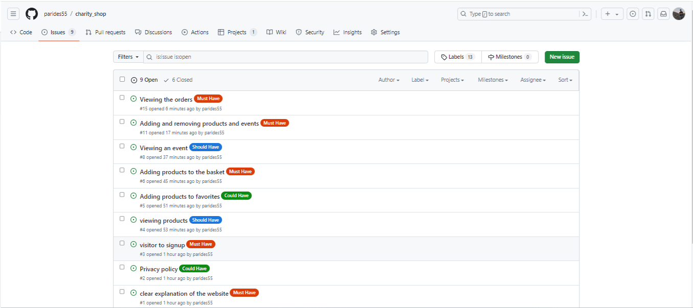

## User stories

User stories were prepared using GitHub Issues and assigned acceptance criteria for each story, which were used for the manual testing.

User Stories can been seen below under [User Story Testing](#user-story-testing), and in the GitHub Issues for full details including screenshots and acceptance criteria.

## UX

As this is a charity shop, and it's purpose is to give hope to families and their kids, I decided to use the green color, as it is regarded as the color of hope. And by choosing a lighter version of the green color is less tiring to the eye and less distractive to the user's eye. Also, the logo of the organization illustrates a happy family. Using [ColorSpace](https://mycolor.space/?hex=%23CCE0C5&sub=1) and [Design.com](https://www.design.com/) the following colors were used.

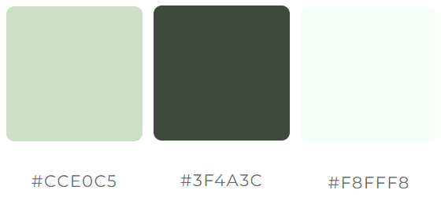

### Typography

- [Roboto google fonts](https://fonts.google.com/specimen/Roboto?query=roboto) were used for the headings.
- [Montserrat google fonts](https://fonts.google.com/specimen/Montserrat?query=montse) were user for all other text.

### Wireframes

Wireframes

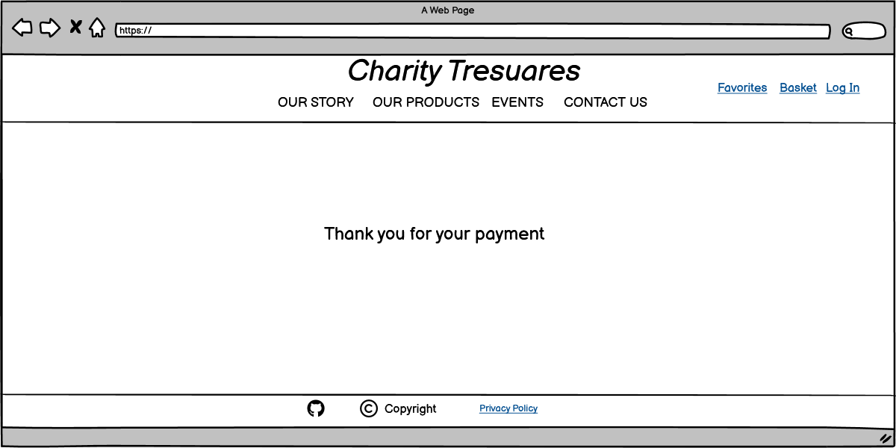
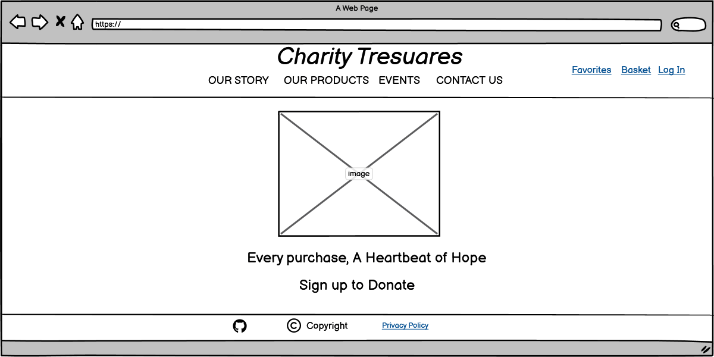
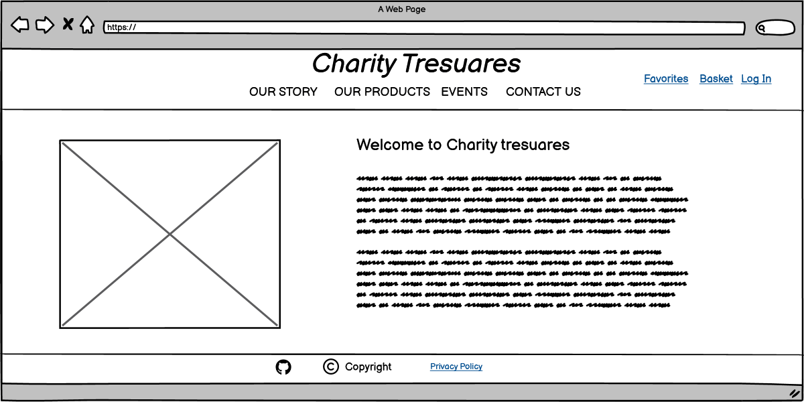

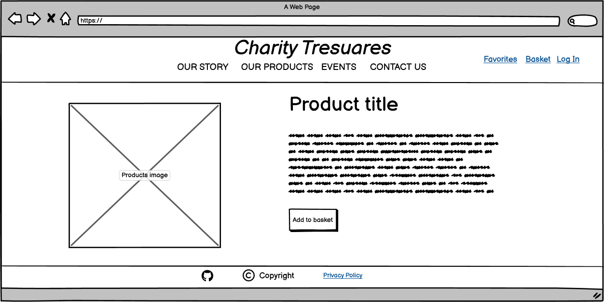
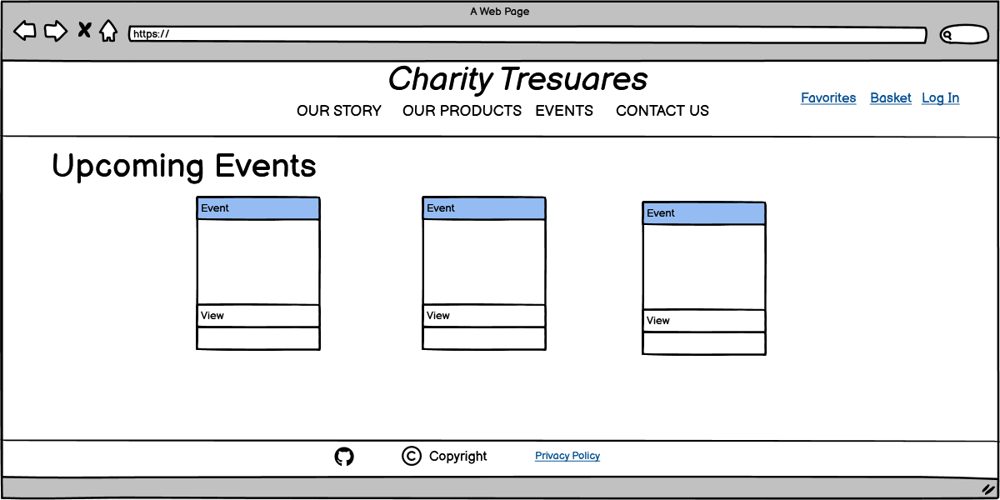
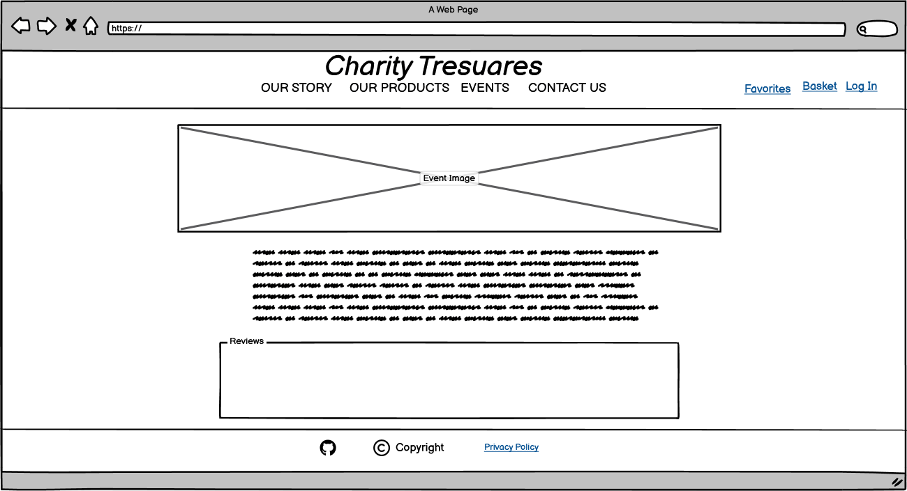
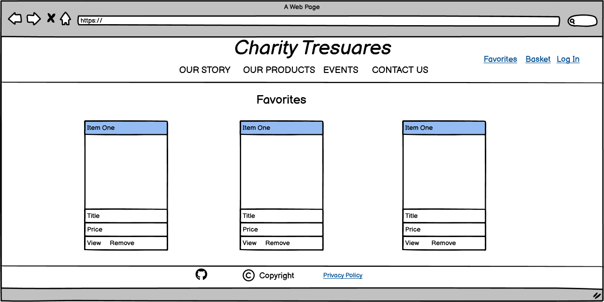
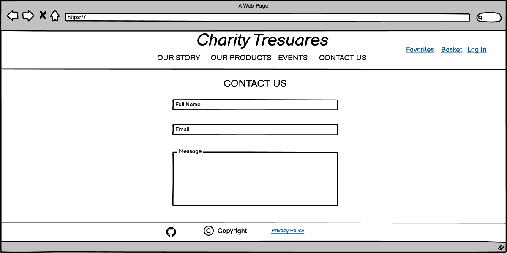

## Accessibility

To ensure maximum accessibility for all users I used `aria-labels` on all Buttons and Anchor tags. Furthermore, after some research, I found that using SVGs instead font icons, maximizes the accessibility to the website. Especially, if the user is using their custom fonts via their browser. This is very nicely presented and explained in Seren Davies' presentation [Death to Icon Fonts](https://www.youtube.com/watch?v=9xXBYcWgCHA)

I, also, ensured that every element still met AAA level in the [Web Content Accessibility Guidelines](https://www.w3.org/WAI/WCAG2AAA-Conformance) (WCAG).

## Database Design

## Features

This website utilizes numerous features from an e-commerce website and a blog. Also, it offers the possibility to the users to sign up by registering a username, an email and a password, in order to allow them to buy products and leave comments/reviews on the events shown.

### Navigation Bar

The navigation bar is shown in all pages and it provides an easy way to navigate throughout the whole website. On the left side the logo of the organization is shown and it is also a link to the home page. A link to the home page is the organization's name on the top which is displayed continuously in all displays. On the right side the user icons are found which they are only shown if the user is authenticated, otherwise just a login icon is shown. Through the user icons, the users can navigate to their favorite page, where their favorite products are stored, to the their basket so they can proceed to check out or to remove the selected products and also to log out.

### Footer

The footer is shown on all pages and it's purpose is to provide a quick and easy access to the this repository and to the privacy policy of the organization. Also, other social media icons can be used in the future, but at this time the webpage does not have any other media.

### Home Page

This is the first page that a user or a visitor will see. It contains in the middle the logo of the organization with and inviting and informative message to the user/visitor. If the user is not authenticated the message includes a sing up link to invite the visitor to register. If it is a returning user the sign up link is not shown and the user is greeted on the top right corner with its username. This feature is displayed on all pages.

### Our Story

This page contains the history of the organization and it explains the website's purpose. It has a picture of the creator and a paragraph text. This page is fully controlled from the admin panel, provided by Django, where the admin can update the page from.

### Our products

This is one of the two main pages of the website where all the products are advertised. The products are displayed on cards and each card shows the products image, its title and price, a button to View the product and a button to add the product to the favorites. When the 'Heart' button is clicked a confirmation message is displayed on the top of the page indicating successful or not addition.

#### View Product

When the 'View' button is clicked on a product the user is taken on a page to view product's details and add it to basket in order to buy it. Also, there is an option to add the product to the user's favorites. When the 'Add to basket' or the 'Heart' button is clicked a confirmation message is displayed on the top of the page indicating successful or not action. Also, the 'Add to basket' button will redirect the user to their basket.

### Our events

This is the second main page of the website where charity events are advertise. The events are displayed on cards and on each card id shown the image of the event, the title of the event and a small description of the event. At the bottom a 'View' button, when clicked will take the user to see the event's details.

#### View event

When the view button is clicked the user is taken to the event's details. Once the page opens, the title of the event and a big hero image is displayed. Bellow the image a text describes the event and below it there's a review section. In the review section, provided the user is authenticated, the user can add a review/comment which will be displayed once it's been approved by the admin. Also, the review can be edited or deleted. The user cannot edit or delete others users's reviews.900

### Contact Us

This page contains a form which when a user or a visitor of the website can complete and send a message to the admin of the website. Once form is submitted a confirmation message is displayed on the top of the page indicating successful or not submition.

### Favorites

In this page the user can view their selected products. The products are displayed on cards which they contain a 'View' button, to take the user to view product's details and add it to basket, and a 'Remove' button, which deletes the product form the user's favorites. When the 'Remove' button is clicked a confirmation message is displayed on the top of the page indicating successful or not removal.

### Basket

This page displays all the items that the user intents to buy. The items are presented in a table format where the Product's title, the quantity, the price per item and the total price for the item is shown. At the bottom of the table the total amount of the order is shown. Also, next to each item there's a 'Remove' button so the user can remove any item. When clicked, a clicked a confirmation message is displayed on the top of the page indicating successful or not removal. At the bottom of the table there are 2 buttons. The 'Continue Shopping' button will redirect the user to the products page and the 'Proceed to Checkout' button will take the user to the payment link provided by Stripe. After successful payment the Stripe website will take the user back to the 'Charity Treasures' website and will show a 'Thank for your payment' message and display 2 buttons. One to search for more products and one to view the events. Lastly, after successful payment the user's items are deleted from their basket.

Because this website is not registered yet with any authorities as an approved charity organization, the transaction happening in the Stripe payment link is in the test mode. Thus only one product is shown for purchase and in order for the purchase to be successful the following credit card details have to be inserted:

Card Number : 4242 4242 4242 4242
Expiry date: Any future date
CVV number: Any 3 digit number

## Technologies used

- [Python](https://www.python.org/)
- [pip](https://pip.pypa.io/en/stable/) for installing Python packages.
- [Git](https://git-scm.com/) for version control.
- [GitHub](https://github.com/) for storing the repository online during development.
- GitHub Projects was invaluable throughout the project and helped me keep track of things to do and bugs to fix - you can see [the project's board here](https://github.com/users/parides55/projects/3).
- Visual Studio Code as an IDE.
- [Balsamiq](https://balsamiq.com/wireframes/) for wireframing.
- [Bootstrap 5](https://getbootstrap.com/) as a front end framework.
- [Bootstrap Icons](https://icons.getbootstrap.com/?q=comment) for the website's icons.
- [diagrams.net](https://www.diagrams.net/) for drawing database diagrams.
- [favicon.io](https://favicon.io/favicon-generator/) to make a favicon for site.
- [Meta Tags](https://metatags.io/) to prepare the Meta tags for social media share previews.
- [ColorSpace](https://mycolor.space/?hex=%23CCE0C5&sub=1) to choose the color palettes.
- [Design.com](https://www.design.com/) to design, generate and edit the logo.
- [Animate.css](https://animate.style/#utilities) to add animation to website's content.
- [Am I responsive](https://ui.dev/amiresponsive) to generate the mock ups.
- [Stripe](https://stripe.com/gb) as an external provider to handle payments.
- [Google Chrome](https://www.google.com/intl/en_ie/chrome/), [Mozilla Firefox](https://www.mozilla.org/en-US/firefox/new/) and [Microsoft Edge](https://www.microsoft.com/en-us/edge) for testing on Windows 11.
- [Safari](https://www.apple.com/safari/) on iOS and iPadOS 17 and iPhoneOS 15.
- [Google Chrome](https://www.google.com/intl/en_ie/chrome/) on Android 14.

## Testing

### Browser Compatibility

### Responsiveness

- screenshots from dev tools

### Performance Testing

- LightHouse report

### Accessibility Testing

- WCAG evaluation tool

### User Story Testing

As a first-time visitor I want to have a clear explanation of the website so that I know what is it about.

AC1 : If I visit the homepage I am greeted with a eye catching slogan/hero image

AC2 : I should be able to tell the purpose of the site easily

Result: Pass ✅

As a visitor to the site I want to read the Privacy policy before I sign up so that I can know how my data will be used.

AC1: By clicking on a link to be directed to a page about the privacy policy

Result: Pass ✅

As a visitor I can signup to the site so that I can buy products, donate, and leave a review.

AC1 : By filling the signup form be able to register an account

AC2 : Be able to Log In

AC3: After logging in the user is able to buy products, donate and leave a review

Result: Pass ✅

As a user I can view all the products so that I can select one to view to buy it.

AC1 : When the user clicks on a link a full list of products is displayed.

AC2 : When a user clicks on a product it can see all the information about it.

Result: Pass ✅

As a user I can add products to my favorites so that I can review them later.

AC1 : By clicking on a button the product is added in user's favorites list.

AC2 : The item can also be removed from the list

Result: Pass ✅

As a user I can add products to my basket so that I can review them again before I buy them.

AC1 : By clicking a button the product is added to user's basket

AC2 : In the user's basket all the selected products are displayed with the total price.

AC3 : By clicking a button the user in taken to a page to insert payment details and once payment is received the items are deleted from the database.

AC4 : The user can remove items from the basket.

Result: Pass ✅

As a user I can leave a review on each event so that I can communicate my thoughts.

AC1 : An authorized user can leave a review on each event

AC2 : All reviews are displayed after admin's approval

AC3 : An authorized user can edit and delete their reviews.

Result: Pass ✅

As a user I can view all the events available so that I know what they are about and attend them.

AC1 : By clicking on a link the user can see a full list of the events

AC2 : By clicking on an event the user can see all the information about the event

Result: Pass ✅

As user/visitor I can read the story of the site so that I can decide if I want to become a member.

AC1 : By clicking on a link the user/visitor can see the information about the website.

Result: Pass ✅

A user/visitor I can contact the admin of the site by filling out the contact us form so that I can communicate with the admin.

AC1 : When the user/visitor clicks on a link is taken to the Contact Us form.

AC2 : By filling out the form a message is send to the admin and confirmation message is shown to the user/visitor.

Result: Pass ✅

As an admin I can add products and events so that I can raise money for the charities.

AC1 : Provide is a logged in user they can add/remove/edit products and events

Result: Pass ✅

As an admin I can read and approve the user’s reviews so that I can filter out objectionable reviews.

AC1 : Provided a logged in user they can approve/disapprove users reviews

AC2 : Provided a logged in user they can add or delete reviews.

Result: Pass ✅

As an admin I can create draft events so that I can finish writing the content later.

AC1 : Provided a logged in user I can add events and save them as drafts.

Result: Pass ✅

As an admin I can create or update the about page content so that it is available on the site.

AC1 : Provided a logged in user they can add and update the content in the about page.

Result: Pass ✅

As an admin I can view the orders made by users so that I can manage them.

AC1 : Provided a logged in user they can view the orders of the users.
Result: Pass ✅

### Code Validation

#### HTML Validation

[W3 HTML Validation](https://validator.w3.org/nu/)

| Page                | URL                        | Results                        |
|---------------------|----------------------------|--------------------------------|
| basket.html         | basket/                    | [No errors or warnings](https://validator.w3.org/nu/?showsource=yes&doc=https%3A%2F%2Fcharity-shop-pp4-2870c2ac8971.herokuapp.com%2Fbasket%2F#l62c22)      |
| favorites.html      | favorites/                 | [No errors or warnings](https://validator.w3.org/nu/?showsource=yes&doc=https%3A%2F%2Fcharity-shop-pp4-2870c2ac8971.herokuapp.com%2Ffavorites%2F#l62c22)      |
| index.html          | ''                         | [No errors or warnings](https://validator.w3.org/nu/?showsource=yes&doc=https%3A%2F%2Fcharity-shop-pp4-2870c2ac8971.herokuapp.com%2F#l62c22)      |
| products.html       | products/                  | [No errors or warnings](https://validator.w3.org/nu/?showsource=yes&doc=https%3A%2F%2Fcharity-shop-pp4-2870c2ac8971.herokuapp.com%2Fproducts%2F#l62c22)      |
| view_product.html   | slug:slug/view_product/    | [No errors or warnings](https://validator.w3.org/nu/?showsource=yes&doc=https%3A%2F%2Fcharity-shop-pp4-2870c2ac8971.herokuapp.com%2Fpiano-toy-red%2Fview_product%2F#l62c22)      |
| contact_us.html     | our-story/contact-us/      | [No errors or warnings](https://validator.w3.org/nu/?showsource=yes&doc=https%3A%2F%2Fcharity-shop-pp4-2870c2ac8971.herokuapp.com%2Four-story%2Fcontact-us%2F#l189c109)      |
| our_story.html      | our-story/                 | [No errors or warnings](https://validator.w3.org/nu/?showsource=yes&doc=https%3A%2F%2Fcharity-shop-pp4-2870c2ac8971.herokuapp.com%2Four-story%2F)      |
| privacy.html        | /our-story/privacy/        | [No errors or warnings](https://validator.w3.org/nu/?showsource=yes&doc=https%3A%2F%2Fcharity-shop-pp4-2870c2ac8971.herokuapp.com%2Four-story%2Fprivacy%2F#l189c109)      |
| events.html         | events/                    | [No errors or warnings](https://validator.w3.org/nu/?showsource=yes&doc=https%3A%2F%2Fcharity-shop-pp4-2870c2ac8971.herokuapp.com%2Fevents%2F#l62c22)      |
| event_info.html     | slug:slug/                 | [No errors or warnings]()      |
| logout.html         | accounts/logout/           | [No errors or warnings](https://validator.w3.org/nu/?showsource=yes&doc=https%3A%2F%2Fcharity-shop-pp4-2870c2ac8971.herokuapp.com%2Faccounts%2Flogout%2F#l62c22)      |
| login.html          | accounts/login/            | [No errors or warnings](https://validator.w3.org/nu/?showsource=yes&doc=https%3A%2F%2Fcharity-shop-pp4-2870c2ac8971.herokuapp.com%2Faccounts%2Flogin%2F#l62c22)      |

#### CSS validation

W3C CSS Validation

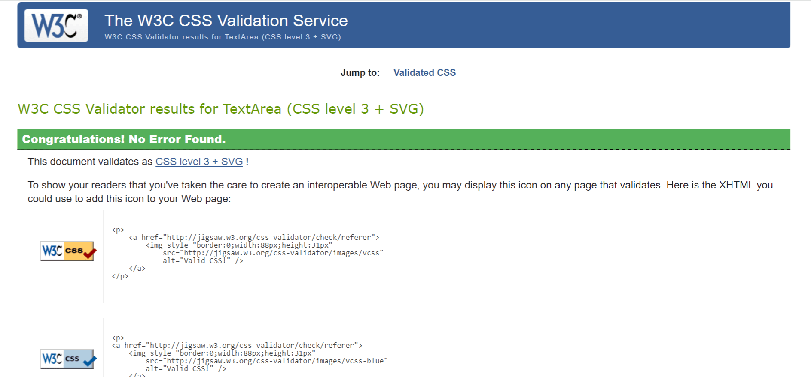

#### JavaScript Validation

JSHint validation screenshot - basket.js

)

JSHint validation screenshot - favorites.js

JSHint validation screenshot - reviews.js

#### Python Validation

PEP8 Online validation - charity_shop/settings.py

PEP8 Online validation - charity_shop/urls.py

PEP8 Online validation - products/admin.py

PEP8 Online validation - products/forms.py

PEP8 Online validation - products/models

PEP8 Online validation - products/urls.py

PEP8 Online validation - products/views.py

PEP8 Online validation - our_story/admin.py

PEP8 Online validation - our_story/forms.py

PEP8 Online validation - our_story/models

PEP8 Online validation - our_story/urls.py

PEP8 Online validation - our_story/views.py

PEP8 Online validation - events/admin.py

PEP8 Online validation - events/forms.py

PEP8 Online validation - events/models

PEP8 Online validation - events/urls.py

PEP8 Online validation - events/views.py

## Deployment

Charity Treasures is deployed to Heroku, using an ElephantSQL Postgres database and Cloudinary for media storage.
To deploy to Heroku, follow these steps:

- Fork or clone this repository in GitHub.
- You will need a Cloudinary account to host user images and static files.
- Login to Cloudinary.
- Select the 'dashboard' option.
- Copy the value of the 'API Environment variable' from the part starting `cloudinary://` to the end. You may need to select the eye icon to view the full environment variable. Paste this value somewhere for safe keeping as you will need it shortly (but destroy after deployment).
- Log in to Heroku.
- Select 'Create new app' from the 'New' menu at the top right.
- Enter a name for the app and select the appropriate region.
- Select 'Create app'.
- Select 'Settings' from the menu at the top.
- Login to ElephantSQL.
- Click 'Create new instance' on the dashboard.
- Name the 'plan' and select the 'Tiny Turtle (free)' plan.
- Select 'select region'.
- Choose the nearest data centre to your location.
- Click 'Review'.
- Go to the ElephantSQL dashboard and click on the 'database instance name' for this project.
- Copy the ElephantSQL database URL to your clipboard (this starts with `postgres://`).
- Return to the Heroku dashboard.
- Select the 'settings' tab.
- Locate the 'reveal config vars' link and select.
- Enter the following config var names and values:
    - `CLOUDINARY_URL`: *your cloudinary URL as obtained above*
    - `DATABASE_URL`: *your ElephantSQL postgres database URL as obtained above*
    - `SECRET_KEY`: *your secret key*
- Select the 'Deploy' tab at the top.
- Select 'GitHub' and confirm you wish to deploy using GitHub. You may be asked to enter your GitHub password.
- Find the 'Connect to GitHub' section and use the search box to locate your repo.
- Select 'Connect' when found.
- Optionally choose the main branch under 'Automatic Deploys' and select 'Enable Automatic Deploys' if you wish your deployed site to be automatically redeployed every time you push changes to GitHub.
- Find the 'Manual Deploy' section, choose 'main' as the branch to deploy and select 'Deploy Branch'.
- Your site will shortly be deployed and you will be given a link to the deployed site when the process is complete.

## Credits

The biggest credits need to go to my wife Maria, who actually took all of the photos of the products and create the description of all of them and actively supported me throughout this project. Also, she wrote the content of the OUR STORY page. 

### Content

- [ Code-Institute-Org/gitpod-full-p3](https://github.com/Code-Institute-Org/gitpod-full-p3) template was used to create this repo.
- Events were taken from Google search
- A lot of reference was taken from the [Developing with Django](https://learn.codeinstitute.net/courses/course-v1:CodeInstitute+FSD101_WTS+2/courseware/31f4d0db719b4ae38601295fa2151b5c/376093d8bf5a4b2abd2e47bdf47b82bf/) code of [Code of Institute](https://codeinstitute.net/global/) project to performed CRUD functionality and establish the models.

### Media

- [Bootstrap Icons](https://icons.getbootstrap.com/) were used extensively in the project

### Acknowledgements

- Thanks to my mentor for his guidance regarding the structure of the models and the successful perfomrance of the basket page.
